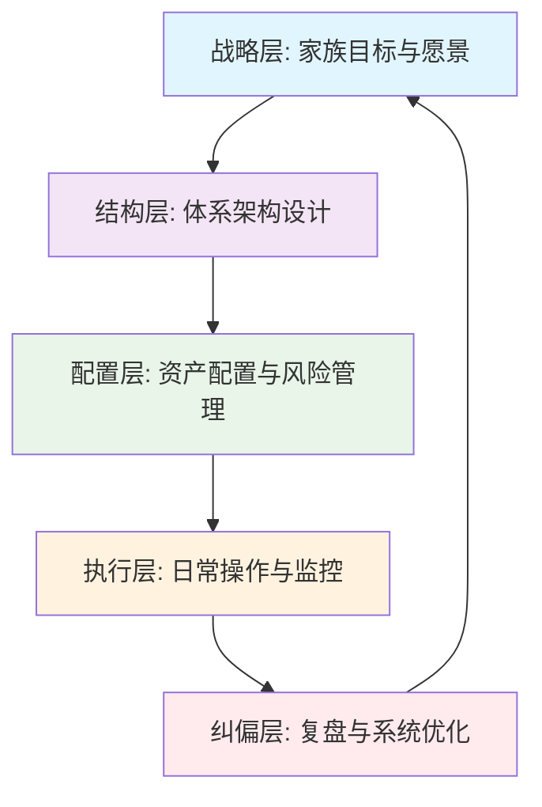
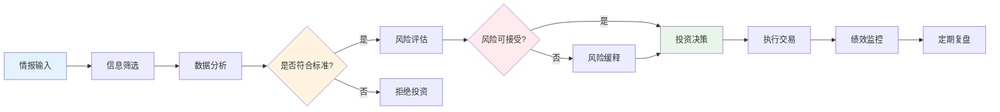
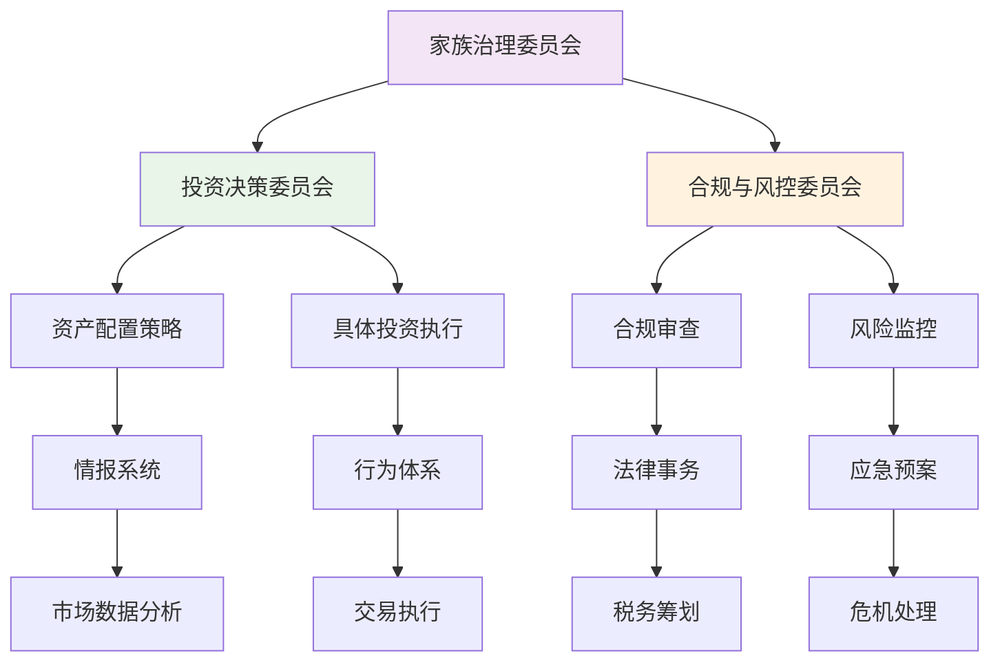
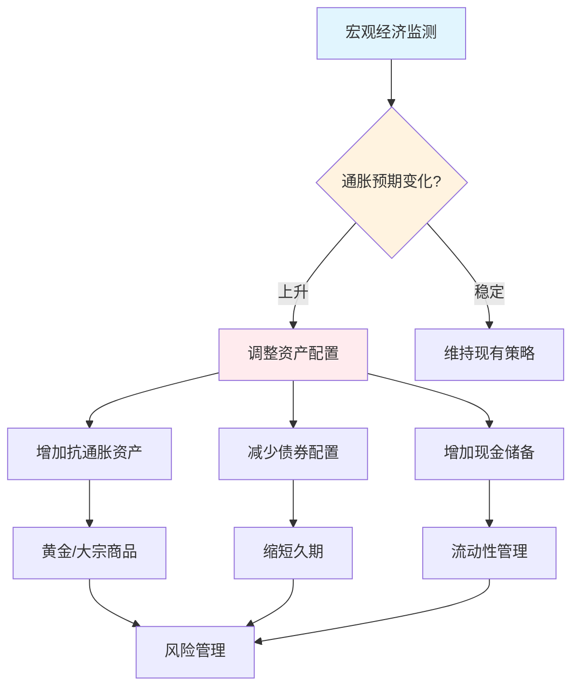
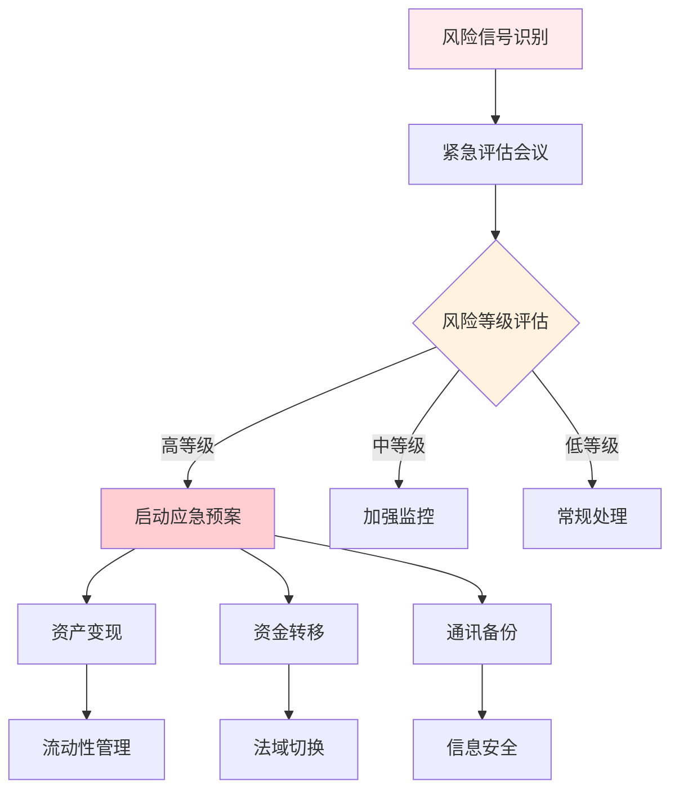
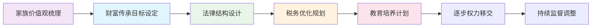

# 关键流程可视化图表

## 项目信息
- **创建时间**: 2026年2月6日
- **维护者**: AI助手
- **用途**: 将项目中的关键业务流程以可视化方式呈现

---

## 1. 家族财富管理核心流程图

---

## 2. 投资决策完整流程图

---

## 3. 家族办公室运行机制图

---

## 4. 信用货币环境应对流程

---

## 5. 危机应对标准流程

---

## 6. 家族传承规划流程

---

## 数据来源和制作说明

### 已可视化的关键流程：
1. **五层主线逻辑架构** - 基于01框架总览
2. **投资决策流程** - 整合09情报系统和10行为体系
3. **家族办公室运行机制** - 基于05体系设计和06家族治理
4. **信用货币环境应对** - 基于02历史结构和08周期配置
5. **危机应对流程** - 基于11运行说明书和12历史反思
6. **家族传承规划** - 基于06家族治理与传承

### 制作方法：
- 使用Mermaid语法创建流程图
- 采用颜色编码区分不同层级和类型
- 确保逻辑关系准确完整
- 保持专业规范的视觉效果

### 后续完善方向：
- 添加更多细分流程图
- 制作交互式可视化图表
- 建立流程图更新维护机制
- 开发配套的说明文档

---
*本文件将持续更新，添加更多关键流程的可视化图表*