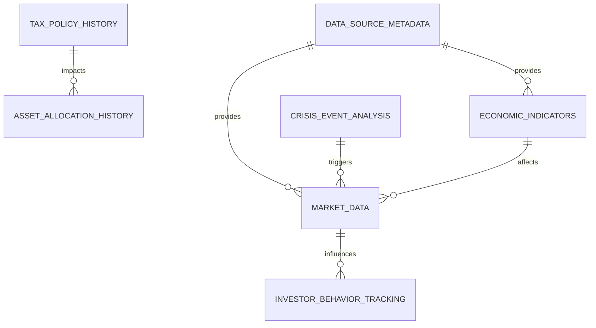

# 专业金融数据库设计方案

## 🎯 设计理念
参考专业炒股软件的数据结构，构建适合家族财富管理的数据库架构

## 🗃️ 核心表结构设计

### 1. 市场数据表 (Market_Data)
```sql
CREATE TABLE market_data (
    id INTEGER PRIMARY KEY AUTOINCREMENT,
    symbol TEXT NOT NULL,                    -- 股票代码/资产标识符
    date DATE NOT NULL,                      -- 交易日期
    open_price REAL,                         -- 开盘价
    high_price REAL,                         -- 最高价
    low_price REAL,                          -- 最低价
    close_price REAL NOT NULL,               -- 收盘价
    volume INTEGER,                          -- 成交量
    adjusted_close REAL,                     -- 复权收盘价
    dividend REAL DEFAULT 0,                 -- 分红
    split_coefficient REAL DEFAULT 1,        -- 拆股系数
    source TEXT NOT NULL,                    -- 数据来源
    fetched_at TIMESTAMP DEFAULT CURRENT_TIMESTAMP,  -- 获取时间
    data_quality_score REAL DEFAULT 1.0,     -- 数据质量评分
    UNIQUE(symbol, date)
);

-- 索引优化
CREATE INDEX idx_market_symbol_date ON market_data(symbol, date);
CREATE INDEX idx_market_date ON market_data(date);
CREATE INDEX idx_market_source ON market_data(source);
```

### 2. 宏观经济指标表 (Economic_Indicators)
```sql
CREATE TABLE economic_indicators (
    id INTEGER PRIMARY KEY AUTOINCREMENT,
    indicator_name TEXT NOT NULL,            -- 指标名称
    country_code TEXT DEFAULT 'US',          -- 国家代码
    date DATE NOT NULL,                      -- 发布日期
    value REAL NOT NULL,                     -- 指标值
    previous_value REAL,                     -- 前值
    forecast_value REAL,                     -- 预期值
    unit TEXT,                               -- 单位
    frequency TEXT CHECK(frequency IN ('daily', 'weekly', 'monthly', 'quarterly', 'yearly')),
    source TEXT NOT NULL,                    -- 数据来源
    fetched_at TIMESTAMP DEFAULT CURRENT_TIMESTAMP,
    reliability_score REAL DEFAULT 1.0,      -- 可靠性评分
    UNIQUE(indicator_name, country_code, date)
);

-- 常用指标索引
CREATE INDEX idx_econ_indicator_date ON economic_indicators(indicator_name, date);
CREATE INDEX idx_econ_country_date ON economic_indicators(country_code, date);
```

### 3. 资产配置历史表 (Asset_Allocation_History)
```sql
CREATE TABLE asset_allocation_history (
    id INTEGER PRIMARY KEY AUTOINCREMENT,
    portfolio_id TEXT NOT NULL,              -- 投资组合ID
    date DATE NOT NULL,                      -- 配置日期
    asset_class TEXT NOT NULL,               -- 资产类别
    allocation_percentage REAL NOT NULL,     -- 配置比例(%)
    market_value REAL NOT NULL,              -- 市场价值
    cost_basis REAL,                         -- 成本基础
    unrealized_gain_loss REAL,               -- 未实现损益
    currency TEXT DEFAULT 'USD',             -- 货币单位
    rebalance_reason TEXT,                   -- 调仓原因
    strategy_reference TEXT,                 -- 策略参考
    recorded_at TIMESTAMP DEFAULT CURRENT_TIMESTAMP,
    UNIQUE(portfolio_id, asset_class, date)
);

-- 查询优化索引
CREATE INDEX idx_allocation_portfolio_date ON asset_allocation_history(portfolio_id, date);
CREATE INDEX idx_allocation_asset_date ON asset_allocation_history(asset_class, date);
```

### 4. 税收政策历史表 (Tax_Policy_History)
```sql
CREATE TABLE tax_policy_history (
    id INTEGER PRIMARY KEY AUTOINCREMENT,
    policy_type TEXT NOT NULL,               -- 政策类型
    jurisdiction TEXT NOT NULL,              -- 管辖区域
    effective_date DATE NOT NULL,            -- 生效日期
    expiration_date DATE,                    -- 到期日期
    rate_percentage REAL,                    -- 税率(%)
    rate_type TEXT CHECK(rate_type IN ('flat', 'progressive', 'regressive')),
    exemption_amount REAL,                   -- 免税额度
    deduction_limit REAL,                    -- 扣除限额
    policy_description TEXT,                 -- 政策描述
    source_document TEXT,                    -- 来源文件
    verified BOOLEAN DEFAULT FALSE,          -- 是否验证
    updated_at TIMESTAMP DEFAULT CURRENT_TIMESTAMP,
    UNIQUE(policy_type, jurisdiction, effective_date)
);

-- 政策查询索引
CREATE INDEX idx_tax_jurisdiction_date ON tax_policy_history(jurisdiction, effective_date);
CREATE INDEX idx_tax_type_date ON tax_policy_history(policy_type, effective_date);
```

### 5. 危机事件与市场反应表 (Crisis_Event_Analysis)
```sql
CREATE TABLE crisis_event_analysis (
    id INTEGER PRIMARY KEY AUTOINCREMENT,
    event_id TEXT NOT NULL UNIQUE,           -- 事件唯一标识
    event_name TEXT NOT NULL,                -- 事件名称
    event_date DATE NOT NULL,                -- 事件发生日期
    event_category TEXT CHECK(event_category IN ('financial', 'political', 'natural_disaster', 'pandemic', 'geopolitical')),
    severity_level INTEGER CHECK(severity_level BETWEEN 1 AND 10),  -- 严重程度
    affected_markets TEXT,                   -- 影响市场(JSON数组)
    trigger_symbols TEXT,                    -- 触发标的(JSON数组)
    market_reaction_data TEXT,               -- 市场反应数据(JSON)
    duration_days INTEGER,                   -- 持续天数
    recovery_period_days INTEGER,            -- 恢复期天数
    economic_impact_estimate REAL,           -- 经济影响估算
    data_sources TEXT,                       -- 数据来源(JSON数组)
    analysis_notes TEXT,                     -- 分析备注
    verified BOOLEAN DEFAULT FALSE,
    created_at TIMESTAMP DEFAULT CURRENT_TIMESTAMP,
    updated_at TIMESTAMP DEFAULT CURRENT_TIMESTAMP
);

-- 事件分析索引
CREATE INDEX idx_crisis_date_severity ON crisis_event_analysis(event_date, severity_level);
CREATE INDEX idx_crisis_category ON crisis_event_analysis(event_category);
```

### 6. 投资者行为追踪表 (Investor_Behavior_Tracking)
```sql
CREATE TABLE investor_behavior_tracking (
    id INTEGER PRIMARY KEY AUTOINCREMENT,
    participant_id TEXT NOT NULL,            -- 参与者ID
    decision_date DATE NOT NULL,             -- 决策日期
    action_type TEXT CHECK(action_type IN ('buy', 'sell', 'hold', 'hedge', 'diversify')),
    asset_symbol TEXT,                       -- 资产代码
    quantity REAL,                           -- 数量
    price_per_unit REAL,                     -- 单价
    total_amount REAL,                       -- 总金额
    portfolio_percentage REAL,               -- 占组合比例
    decision_rationale TEXT,                 -- 决策理由
    market_conditions TEXT,                  -- 市场环境描述
    risk_assessment TEXT,                    -- 风险评估
    confidence_level INTEGER CHECK(confidence_level BETWEEN 1 AND 10),  -- 信心等级
    outcome_measured BOOLEAN DEFAULT FALSE,  -- 是否已测量结果
    actual_return REAL,                      -- 实际收益率
    benchmark_comparison REAL,               -- 相对于基准的表现
    measured_at DATE,                        -- 测量日期
    performance_notes TEXT,                  -- 表现备注
    recorded_at TIMESTAMP DEFAULT CURRENT_TIMESTAMP
);

-- 行为分析索引
CREATE INDEX idx_behavior_participant_date ON investor_behavior_tracking(participant_id, decision_date);
CREATE INDEX idx_behavior_action_date ON investor_behavior_tracking(action_type, decision_date);
CREATE INDEX idx_behavior_symbol_date ON investor_behavior_tracking(asset_symbol, decision_date);
```

### 7. 数据源元信息表 (Data_Source_Metadata)
```sql
CREATE TABLE data_source_metadata (
    id INTEGER PRIMARY KEY AUTOINCREMENT,
    source_name TEXT NOT NULL UNIQUE,        -- 数据源名称
    source_type TEXT CHECK(source_type IN ('official', 'financial', 'alternative', 'news')),
    base_url TEXT,                           -- 基础URL
    api_endpoint TEXT,                       -- API端点
    authentication_required BOOLEAN DEFAULT FALSE,
    auth_method TEXT,                        -- 认证方式
    rate_limit INTEGER,                      -- 请求频率限制
    data_format TEXT CHECK(data_format IN ('json', 'csv', 'xml', 'api')),
    last_accessed TIMESTAMP,                 -- 最后访问时间
    success_rate REAL DEFAULT 1.0,           -- 成功率
    average_response_time REAL,              -- 平均响应时间
    reliability_score REAL DEFAULT 1.0,      -- 可靠性评分
    supported_indicators TEXT,               -- 支持的指标(JSON数组)
    contact_info TEXT,                       -- 联系信息
    created_at TIMESTAMP DEFAULT CURRENT_TIMESTAMP,
    updated_at TIMESTAMP DEFAULT CURRENT_TIMESTAMP
);

-- 数据源查询索引
CREATE INDEX idx_source_type ON data_source_metadata(source_type);
CREATE INDEX idx_source_reliability ON data_source_metadata(reliability_score);
```

## 🔗 表关系图



## 📊 查询视图设计

### 1. 综合行情视图
```sql
CREATE VIEW market_overview_view AS
SELECT 
    md.symbol,
    md.date,
    md.close_price,
    md.volume,
    md.adjusted_close,
    ei.indicator_name,
    ei.value as indicator_value,
    ROW_NUMBER() OVER (PARTITION BY md.symbol ORDER BY md.date DESC) as rn
FROM market_data md
LEFT JOIN economic_indicators ei ON md.date = ei.date
WHERE md.date >= date('now', '-30 days')
ORDER BY md.symbol, md.date DESC;
```

### 2. 资产配置分析视图
```sql
CREATE VIEW asset_allocation_analysis AS
SELECT 
    aah.portfolio_id,
    aah.asset_class,
    aah.date,
    aah.allocation_percentage,
    aah.market_value,
    LAG(aah.allocation_percentage) OVER (
        PARTITION BY aah.portfolio_id, aah.asset_class 
        ORDER BY aah.date
    ) as previous_allocation,
    aah.allocation_percentage - LAG(aah.allocation_percentage) OVER (
        PARTITION BY aah.portfolio_id, aah.asset_class 
        ORDER BY aah.date
    ) as allocation_change,
    aah.rebalance_reason
FROM asset_allocation_history aah
WHERE aah.date >= date('now', '-1 year');
```

### 3. 危机影响分析视图
```sql
CREATE VIEW crisis_impact_analysis AS
SELECT 
    cea.event_name,
    cea.event_date,
    cea.severity_level,
    cea.duration_days,
    cea.economic_impact_estimate,
    md.symbol,
    md.date,
    md.close_price,
    LAG(md.close_price, cea.duration_days) OVER (
        PARTITION BY md.symbol 
        ORDER BY md.date
    ) as pre_crisis_price,
    ((md.close_price - LAG(md.close_price, cea.duration_days) OVER (
        PARTITION BY md.symbol 
        ORDER BY md.date
    )) / LAG(md.close_price, cea.duration_days) OVER (
        PARTITION BY md.symbol 
        ORDER BY md.date
    )) * 100 as price_change_percent
FROM crisis_event_analysis cea
JOIN market_data md ON md.date BETWEEN 
    date(cea.event_date) AND 
    date(cea.event_date, '+' || cea.duration_days || ' days')
ORDER BY cea.event_date DESC, md.symbol;
```

## 🛡️ 数据完整性约束

### 外键约束
```sql
-- 投资者行为与市场数据关联
ALTER TABLE investor_behavior_tracking 
ADD CONSTRAINT fk_behavior_market_data 
FOREIGN KEY (asset_symbol, decision_date) 
REFERENCES market_data(symbol, date);

-- 资产配置与税收政策关联
ALTER TABLE asset_allocation_history 
ADD CONSTRAINT fk_allocation_tax_policy 
FOREIGN KEY (date) 
REFERENCES tax_policy_history(effective_date);
```

### 触发器维护数据一致性
```sql
-- 自动更新时间戳
CREATE TRIGGER update_timestamp 
AFTER UPDATE ON market_data
BEGIN
    UPDATE market_data SET updated_at = CURRENT_TIMESTAMP WHERE id = NEW.id;
END;

-- 数据质量评分自动计算
CREATE TRIGGER calculate_data_quality
AFTER INSERT ON market_data
BEGIN
    UPDATE market_data 
    SET data_quality_score = CASE 
        WHEN NEW.source IN ('FRED', 'Yahoo Finance', 'SEC') THEN 0.95
        WHEN NEW.source LIKE '%official%' THEN 0.9
        ELSE 0.7
    END
    WHERE id = NEW.id;
END;
```

## 📈 性能优化策略

### 1. 分区策略
```sql
-- 按年份分区市场数据表
CREATE TABLE market_data_partitioned (
    id INTEGER PRIMARY KEY AUTOINCREMENT,
    symbol TEXT NOT NULL,
    date DATE NOT NULL,
    close_price REAL NOT NULL,
    volume INTEGER,
    source TEXT NOT NULL,
    fetched_at TIMESTAMP DEFAULT CURRENT_TIMESTAMP
) PARTITION BY RANGE (date);

-- 创建年度分区
CREATE TABLE market_data_2020 PARTITION OF market_data_partitioned
FOR VALUES FROM ('2020-01-01') TO ('2021-01-01');

CREATE TABLE market_data_2021 PARTITION OF market_data_partitioned
FOR VALUES FROM ('2021-01-01') TO ('2022-01-01');
```

### 2. 物化视图定期刷新
```sql
-- 创建物化视图
CREATE MATERIALIZED VIEW mv_monthly_returns AS
SELECT 
    symbol,
    strftime('%Y-%m', date) as month,
    (MAX(close_price) - MIN(close_price)) / MIN(close_price) * 100 as monthly_return
FROM market_data
GROUP BY symbol, strftime('%Y-%m', date)
ORDER BY symbol, month;

-- 定期刷新（可通过定时任务实现）
-- REFRESH MATERIALIZED VIEW mv_monthly_returns;
```

## 🔐 数据安全与备份

### 1. 访问控制
```sql
-- 创建只读用户
CREATE USER readonly_user WITH PASSWORD 'secure_password';
GRANT SELECT ON ALL TABLES IN SCHEMA public TO readonly_user;

-- 创建分析师用户（可读写部分表）
CREATE USER analyst_user WITH PASSWORD 'another_secure_password';
GRANT SELECT, INSERT, UPDATE ON market_data, economic_indicators TO analyst_user;
```

### 2. 备份策略
```sql
-- 完整备份脚本示例
-- pg_dump -h localhost -U username -F c -b -v -f "backup_$(date +%Y%m%d_%H%M%S).sql" family_wealth_db

-- 增量备份（基于WAL日志）
-- pg_basebackup -h localhost -D /backup/incremental -U replication_user -P -v
```

这个数据库设计充分参考了专业金融软件的数据结构，支持高效的查询和分析，同时保持了良好的扩展性。