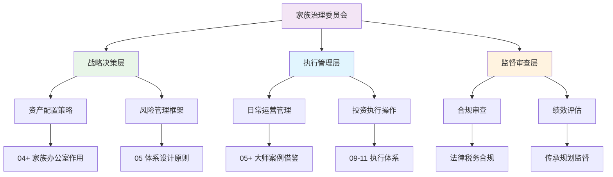

# 流程图样式指南

> **文件摘要**: 本文档详细说明了项目中流程图的设计规范、样式标准和维护要求，确保所有可视化图表保持一致性和专业性。

## 📊 流程图设计规范

### 1. 基本结构要求

**层级架构**：
- 采用三分法治理结构：战略决策层 → 执行管理层 → 监督审查层
- 形成完整的决策→执行→监督闭环
- 避免扁平化的二分法结构

**节点命名规范**：
- 使用简洁明确的中文标签
- 首要节点标明具体文档章节关联
- 避免过于抽象或模糊的表述

### 2. 颜色编码标准

| 层级 | 颜色代码 | 用途说明 |
|------|----------|----------|
| 治理层 | `#f3e5f5` (浅紫色) | 家族治理委员会等顶层设计 |
| 战略层 | `#e8f5e8` (浅绿色) | 资产配置、风险管理等战略职能 |
| 执行层 | `#e1f5fe` (浅蓝色) | 日常运营、投资执行等操作职能 |
| 监督层 | `#fff3e0` (浅橙色) | 合规审查、绩效评估等监督职能 |

### 3. 样式应用示例

#### 家族办公室运行机制图标准模板

## 🎨 视觉设计原则

### 1. 层次清晰性
- 不同层级使用不同颜色背景
- 连接线保持简洁，避免交叉混乱
- 重要节点适当加大字体或加粗显示

### 2. 信息关联性
- 关键节点直接链接到具体文档章节
- 使用标准化的章节编号引用
- 保持与文档结构的高度一致性

### 3. 可读性优化
- 文字大小适中，确保清晰可辨
- 节点间距合理，避免过于拥挤
- 整体布局平衡，视觉重心稳定

## 🔧 维护管理要求

### 1. 更新同步机制
- 文档结构调整时必须同步更新相关流程图
- 新增章节需在对应流程图中体现
- 定期审查流程图与文档的一致性

### 2. 版本控制要求
- 流程图变更需在CHANGE_LOG中记录
- 重大样式调整需说明变更原因
- 保持历史版本的可追溯性

### 3. 质量检查标准
- [ ] 颜色编码符合标准规范
- [ ] 层级结构逻辑清晰完整
- [ ] 与文档内容保持准确对应
- [ ] 视觉效果专业美观

## 📋 应用场景分类

### 1. 核心业务流程图
- 家族财富管理五层架构图
- 投资决策完整流程图
- 家族办公室运行机制图

### 2. 专题分析流程图
- 信用货币环境应对流程
- 危机应对标准流程
- 家族传承规划流程

### 3. 系统操作流程图
- 情报系统工作流程
- 行为体系执行流程
- 运行说明书操作流程

## 🎯 最佳实践建议

### 1. 设计阶段
- 先绘制草图确定逻辑关系
- 选择合适的图表类型（流程图、架构图、循环图等）
- 预估信息密度和复杂程度

### 2. 实现阶段
- 严格按照颜色编码标准执行
- 确保文字表述准确无歧义
- 测试不同设备上的显示效果

### 3. 审核阶段
- 邀请相关人员验证逻辑正确性
- 检查与相关文档的一致性
- 收集用户体验反馈并优化

---
*本指南将根据项目发展和用户反馈持续更新完善*