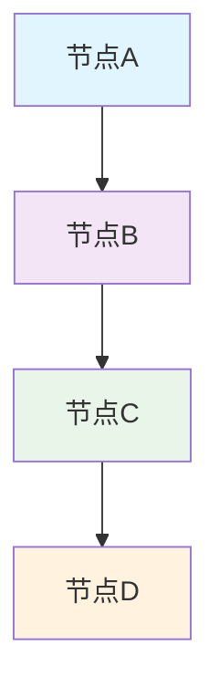

# 可视化图表制作方法与原始数据说明

> **文件摘要**: 本文档详细说明了项目中可视化图表的制作方法、技术规范、数据来源和维护要求，为图表制作提供完整的技术指导和标准化流程。

## 🛠️ 制作方法详解

### 1. 技术栈选择

**主要工具**：
- **Mermaid.js**：主要绘图引擎，支持流程图、序列图、甘特图等多种图表类型
- **Markdown**：文档集成格式，便于版本控制和协作
- **HTML/CSS**：高级定制和交互效果实现

**选择理由**：
- 轻量级，无需额外软件安装
- 与Git版本控制完美兼容
- 支持实时渲染和预览
- 语法简洁，学习成本低

### 2. Mermaid语法规范

#### 基础语法结构

#### 常用元素类型
- **方形节点**：`A[文本内容]`
- **圆形节点**：`A((文本内容))`
- **菱形节点**：`A{条件判断}`
- **圆角矩形**：`A(文本内容)`

#### 连接线样式
- **实线箭头**：`-->`
- **虚线箭头**：`-.->`
- **粗线箭头**：`==>`

### 3. 制作流程标准化

#### 步骤一：需求分析
1. 确定图表类型（流程图/架构图/循环图）
2. 明确核心信息和关键节点
3. 分析目标受众和使用场景
4. 确定与文档的关联关系

#### 步骤二：结构设计
1. 绘制草图确定逻辑关系
2. 设计层级结构和颜色编码
3. 规划节点布局和信息密度
4. 验证逻辑完整性和准确性

#### 步骤三：技术实现
1. 编写Mermaid代码
2. 应用样式规范
3. 添加交互元素（如需要）
4. 测试不同环境下的显示效果

#### 步骤四：质量审核
1. 内容准确性验证
2. 视觉效果优化
3. 用户体验测试
4. 文档同步更新

## 📊 原始数据来源说明

### 1. 数据采集渠道

#### 内部文档数据
- **框架总览**：01-framework-overview.md（五层架构逻辑）
- **历史结构**：02-historical-structure.md（时间线和发展脉络）
- **参与者层级**：03-actors-and-tiers.md（角色定位和关系）
- **游戏机制**：04-game-mechanics-and-strategy.md（运行规则）
- **体系设计**：05-system-design-principles.md（设计原则）

#### 外部权威数据
- **经济指标**：世界银行、IMF官方统计数据
- **金融市场**：各大交易所公开数据
- **政策法规**：各国监管机构官方文件
- **学术研究**：知名院校和研究机构报告

### 2. 数据处理规范

#### 数据清洗标准
- 去除重复和矛盾信息
- 统一计量单位和时间基准
- 验证数据来源的可靠性
- 标注数据时效性和适用范围

#### 数据整合方法
- 建立统一的数据字典
- 设计标准化的数据模板
- 实现数据的可追溯性
- 建立定期更新机制

### 3. 数据验证流程

#### 内部验证
- 交叉引用多个文档源
- 邀请领域专家评审
- 进行逻辑一致性检查
- 测试极端情况下的合理性

#### 外部验证
- 对比权威机构数据
- 参考同行评议文献
- 验证时效性和准确性
- 收集用户反馈并优化

## 🎨 设计规范与标准

### 1. 颜色编码体系

#### 标准配色方案
| 层级类型 | 颜色代码 | RGB值 | 用途说明 |
|---------|---------|-------|---------|
| 治理层 | 浅紫色 | #f3e5f5 | 243,229,245 | 顶层设计和决策机构 |
| 战略层 | 浅绿色 | #e8f5e8 | 232,245,232 | 战略规划和资源配置 |
| 执行层 | 浅蓝色 | #e1f5fe | 225,245,254 | 日常运营和具体执行 |
| 监督层 | 浅橙色 | #fff3e0 | 255,243,224 | 合规审查和绩效监控 |
| 特殊节点 | 浅红色 | #ffebee | 255,235,238 | 风险警示和关键决策点 |

#### 颜色使用原则
- 同一层级使用相同背景色
- 相邻层级颜色对比度≥3:1
- 重要节点可使用加粗边框突出
- 避免使用过多颜色造成视觉混乱

### 2. 字体和排版规范

#### 字体规格
- **节点文字**：14px，微软雅黑/思源黑体
- **标题文字**：16px，加粗
- **说明文字**：12px，斜体
- **数值标注**：13px，等宽字体

#### 排版要求
- 节点间最小间距：20px
- 文字与边框间距：10px
- 图表整体宽度：不超过800px
- 响应式设计适配移动端

### 3. 交互设计规范

#### 基础交互
- 鼠标悬停显示详细信息
- 点击节点跳转到相关文档
- 支持图表缩放和平移
- 提供下载PNG/SVG选项

#### 高级功能
- 动态数据更新显示
- 多图表联动分析
- 自定义视图配置
- 用户偏好设置保存

## 🔧 维护管理机制

### 1. 更新流程

#### 定期更新
- **月度审查**：检查数据时效性
- **季度更新**：根据文档变更调整图表
- **年度重构**：优化整体结构和设计

#### 触发更新
- 文档重大修订时
- 发现数据错误时
- 用户反馈问题时
- 技术标准变更时

### 2. 版本控制

#### 版本命名规范
- 格式：`v主版本.次版本.修订版本`
- 示例：`v1.2.0` 表示第一次大版本的第二次小更新

#### 变更记录要求
- 详细说明变更内容和原因
- 标注影响范围和相关文档
- 记录变更时间和责任人
- 保留历史版本便于回溯

### 3. 质量保证

#### 自动化检查
- 语法正确性验证
- 链接有效性检测
- 样式规范性审查
- 性能优化建议

#### 人工审核
- 内容准确性确认
- 用户体验评估
- 专业性把关
- 创新性评价

## 📈 扩展发展方向

### 1. 技术升级路线

#### 短期目标（1-3个月）
- 集成更多图表类型支持
- 优化移动端显示效果
- 增强交互功能体验
- 建立自动化生成工具

#### 中期规划（3-12个月）
- 开发专用编辑器工具
- 实现数据驱动的动态图表
- 构建图表组件库
- 建立协作编辑平台

#### 长期愿景（1年以上）
- AI辅助图表设计
- 智能化内容推荐
- 个性化展示定制
- 生态化工具集成

### 2. 应用场景拓展

#### 内部使用
- 项目管理和进度跟踪
- 知识体系可视化
- 培训材料制作
- 决策支持系统

#### 外部分享
- 客户演示和汇报
- 公开演讲和讲座
- 教育培训课程
- 研究报告展示

---

*本文件将持续更新，跟踪制作方法的演进和最佳实践的积累*