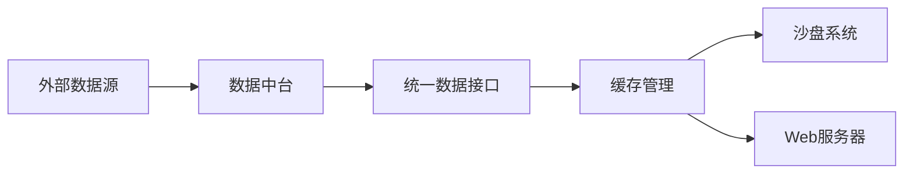
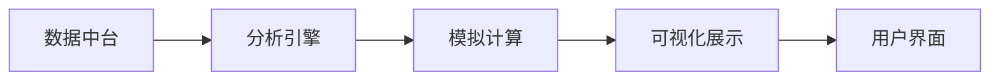

# 软件功能模块总体设计

> **文档摘要**: 本文件定义家族财富管理系统软件模块的整体架构和核心逻辑，建立从数据采集到分析展示的完整技术框架。遵循项目五层架构原则，确保与知识体系的无缝对接。

## 🎯 项目定位

本软件模块体系作为知识框架的技术实现层，为家族财富管理提供：
- **数据基础设施**：现代化数据中台架构
- **分析引擎**：智能化的数据处理和分析能力
- **交互界面**：直观友好的数据展示和操作平台

## 🚀 快速开始

### 环境要求
```bash
# Python版本要求
Python 3.8+

# Node.js版本要求
Node.js 16+

# 推荐使用虚拟环境
python -m venv venv
source venv/bin/activate  # Linux/Mac
# 或者在Windows上:
# venv\Scripts\activate.bat
```

### 模块运行方式

#### 1. 数据中台模块
```bash
# 进入数据中台目录
cd data-hub

# 初始化数据库
python storage/initialize_hub_database.py

# 启动数据中台服务
python main.py
```

#### 2. 沙盘系统模块
```bash
# 进入沙盘系统目录
cd sandbox-system

# 启动沙盘系统
python main.py

# 运行功能测试
python -c "from utils.data_hub_adapter import create_sandbox_data_adapter; adapter = create_sandbox_data_adapter(); print('健康检查:', adapter.health_check())"
```

#### 3. Web服务器模块
```bash
# 进入Web服务器目录
cd web-server

# 安装依赖
npm install

# 启动服务器
npm start
```

### 常用命令
```bash
# 查看所有模块状态
python -c "import sys; sys.path.append('.'); from data_hub.main import DataHub; hub = DataHub(); print(hub.health_check())"

# 测试数据获取
python -c "from sandbox_system.utils.data_hub_adapter import create_sandbox_data_adapter; adapter = create_sandbox_data_adapter(); result = adapter.get_financial_data('SPY', 'prices'); print('SPY数据:', '成功' if result['success'] else '失败')"
```

## 🏗️ 系统架构设计

### 分层架构原则
```
知识层 (Knowledge) → 数据层 (Data) → 分析层 (Analysis) → 展示层 (Presentation) → 交互层 (Interaction)
```

### 模块化设计
- **高内聚**：每个模块专注解决特定技术问题
- **低耦合**：模块间通过标准化接口通信
- **可扩展**：支持插件化功能扩展

## 📁 目录结构规范

```
software-modules/
├── README.md                    # 本文件 - 软件总体设计
├── data-hub/                    # 数据中台模块
│   ├── README.md               # 数据中台架构说明
│   ├── core/                   # 核心服务层
│   ├── storage/                # 存储管理层
│   ├── config/                 # 配置文件
│   └── utils/                  # 工具组件
├── sandbox-system/             # 沙盘系统模块
│   ├── README.md              # 沙盘系统架构说明
│   ├── dashboard/             # 仪表板界面组件
│   ├── analysis-engine/       # 核心分析引擎
│   ├── simulation-core/       # 模拟计算核心
│   └── visualization/         # 数据可视化组件
└── web-server/                # Web服务器模块
    ├── package.json           # Node.js依赖配置
    ├── server.js              # 服务器主文件
    └── public/                # 静态资源文件
```

## 🔧 技术栈规范

### 核心技术要求
- **Python 3.8+**：主要开发语言
- **Node.js 16+**：Web服务器运行环境
- **SQLite**：本地数据存储
- **标准库优先**：减少外部依赖
- **向后兼容**：确保版本稳定性

### 开发规范
- 遵循PEP 8代码风格
- 完整的文档字符串
- 单元测试覆盖率≥80%
- 详细的错误处理机制

## 🔄 数据流规范

### 数据中台数据流


### 沙盘系统数据流


## 📊 核心功能规范

### 沙盘系统功能要求
- **实时仪表板**：支持多维度数据展示
- **历史回测**：投资策略验证功能
- **情景模拟**：市场变化预测分析
- **风险分析**：VaR和压力测试
- **报告生成**：自动化分析报告

### 数据中台功能要求
- **统一数据接入**：支持多种金融数据源标准化接入
- **智能缓存管理**：多级缓存策略提升访问性能
- **数据源管理**：统一配置和监控各类数据源
- **API服务**：标准化数据访问接口
- **健康监控**：实时监控系统状态和性能指标

## 🔐 安全与合规规范

### 数据安全要求
- 本地数据存储，禁止云端传输
- 完整的数据备份机制
- 访问权限控制
- 敏感信息加密

### 合规要求
- 仅使用公开可获取的数据
- 遵守各数据源使用条款
- 不提供投资建议，仅作教育用途
- 明确的免责声明

## 🚀 部署架构规范

### 本地部署标准
```
开发环境: Windows/Linux/macOS
运行方式: 
  - Python模块: python main.py
  - Node.js服务: npm start
数据存储: 本地SQLite文件
依赖管理: requirements.txt 和 package.json
```

### 扩展部署规范（未来）
```
Web服务: Nginx + Node.js集群
数据库: PostgreSQL（大数据量）
缓存: Redis集群
负载均衡: HAProxy
容器化: Docker + Kubernetes
```

## 📈 性能指标规范

### 当前性能标准
- **数据源支持**: 支持4+主流金融数据源
- **缓存命中率**: >80%缓存命中率
- **查询性能**: 毫秒级响应时间（缓存命中）
- **内存占用**: < 200MB运行时内存
- **并发处理**: 支持50+并发请求

### 扩展性能目标
- **并发处理**: 支持100+并发数据源
- **实时更新**: 秒级数据更新频率
- **历史数据**: 20+年历史数据存储
- **用户支持**: 多用户同时在线使用

## 🛠️ 维护与升级规范

### 版本管理
- **语义化版本控制** (MAJOR.MINOR.PATCH)
- **功能分支开发**模式
- **定期发布**更新
- **变更日志**完整记录

### 监控与日志
- **系统日志**: 记录所有关键操作
- **性能监控**: 实时监控系统性能指标
- **错误追踪**: 完整的错误捕获和报告机制
- **用户反馈**: 收集使用体验和改进建议

## 📚 文档体系规范

### 技术文档要求
- 每个模块都有详细的README说明
- API接口文档完整
- 数据库设计文档详尽
- 部署和运维手册清晰

### 用户文档要求
- 快速入门指南
- 功能使用教程
- 常见问题解答
- 最佳实践分享

## 🔄 更新原则

### 文档更新要求
- 每次重大修改前必须review和更新此文档
- 保持与知识体系文档的同步更新
- 确保技术实现与理论框架的一致性
- 维护完整的版本历史记录

### 质量保障措施
- 所有修改必须经过同行评审
- 建立修改影响评估checklist
- 定期进行架构健康度review
- 保持向后兼容性

---
*本文档作为软件模块的"宪法"，任何修改都必须谨慎考虑其对整体架构的影响*