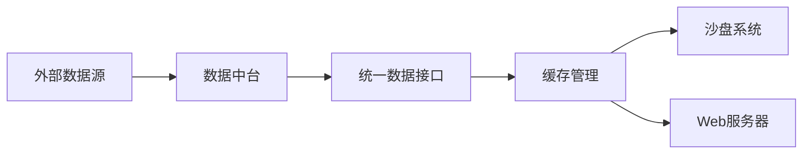

# 软件功能模块总体设计

> **文档摘要**: 本文件定义家族财富管理系统软件模块的整体架构和核心逻辑，重点在于为知识体系提供数据支撑和技术实现。遵循项目五层架构原则，确保与知识体系的无缝对接。

## 🎯 项目定位

本软件模块体系专注于为家族财富管理知识体系提供：
- **数据支撑**：为理论分析提供基础数据支持
- **工具整合**：集成现有成熟软件工具
- **知识应用**：将理论框架转化为实用工具

## 📚 核心理念

我们采用"知识驱动、工具整合"的策略：
1. **专注知识体系建设** - 将主要精力投入到理论框架构建
2. **整合成熟工具** - 利用业界已有优秀软件
3. **适度技术实现** - 仅在必要时进行技术开发
4. **保持简洁实用** - 避免过度工程化

## 🚀 快速开始

### 环境要求
```bash
# Python版本要求
Python 3.8+

# Node.js版本要求
Node.js 16+

# 推荐使用虚拟环境
python -m venv venv
source venv/bin/activate  # Linux/Mac
# 或者在Windows上:
# venv\Scripts\activate.bat
```

### 模块运行方式

#### 1. 信息收集器模块
```bash
# 进入信息收集器目录
cd data-collector

# 初始化专业数据库
python storage/initialize_professional_database.py

# 启动数据收集器
python main.py
```

#### 2. Web服务器模块
```bash
# 进入Web服务器目录
cd web-server

# 安装依赖
npm install

# 启动服务器
npm start
```

### 常用命令
```bash
# 测试信息收集器功能
python -c "from data_collector.processors.financial_data_analyzer import FinancialDataAnalyzer; analyzer = FinancialDataAnalyzer('storage/family_wealth_professional.db'); print('数据库连接:', '成功' if analyzer else '失败')"
```

## 🏗️ 系统架构设计

### 分层架构原则
```
知识层 (Knowledge) → 数据层 (Data) → 分析层 (Analysis) → 展示层 (Presentation) → 交互层 (Interaction)
```

### 模块化设计
- **高内聚**：每个模块专注解决特定技术问题
- **低耦合**：模块间通过标准化接口通信
- **可扩展**：支持插件化功能扩展

## 📁 目录结构规范

## 📁 当前模块结构

```
software-modules/
├── README.md                    # 本文件 - 软件总体设计
├── data-hub/                    # 数据支撑模块
│   ├── README.md               # 数据支撑架构说明
│   ├── data-sources/           # 数据源配置
│   ├── storage/                # 数据存储管理
│   └── core/                   # 核心数据处理
└── web-server/                 # Web服务模块
    ├── package.json            # Node.js依赖配置
    ├── server.js               # 服务器主文件
    └── public/                 # 静态资源文件
```

## 🔧 技术栈规范

## 🔧 技术栈规范

### 核心技术要求
- **Python 3.8+**：数据处理和分析
- **Node.js 16+**：Web服务运行环境
- **SQLite**：本地数据存储
- **标准库优先**：减少外部依赖
- **向后兼容**：确保版本稳定性

### 开发原则
- **简约实用**：避免过度设计
- **文档驱动**：先完善理论再考虑实现
- **工具整合**：优先使用现有成熟工具
- **渐进完善**：小步快跑，持续改进

### 开发规范
- 遵循PEP 8代码风格
- 完整的文档字符串
- 单元测试覆盖率≥80%
- 详细的错误处理机制

## 🔄 数据流规范

### 数据中台数据流


### 沙盘系统数据流


## 📊 核心功能定位

### 数据支撑功能
- **基础数据获取**：为知识体系提供必要的数据支持
- **数据质量管理**：确保数据的准确性和完整性
- **存储优化**：高效的本地数据管理
- **接口标准化**：统一的数据访问接口

## 🔐 安全与合规规范

### 数据安全要求
- 本地数据存储，禁止云端传输
- 完整的数据备份机制
- 访问权限控制
- 敏感信息加密

### 合规要求
- 仅使用公开可获取的数据
- 遵守各数据源使用条款
- 不提供投资建议，仅作教育用途
- 明确的免责声明

## 🚀 部署架构规范

### 本地部署标准
```
开发环境: Windows/Linux/macOS
运行方式: 
  - Python模块: python main.py
  - Node.js服务: npm start
数据存储: 本地SQLite文件
依赖管理: requirements.txt 和 package.json
```

### 扩展部署规范（未来）
```
Web服务: Nginx + Node.js集群
数据库: PostgreSQL（大数据量）
缓存: Redis集群
负载均衡: HAProxy
容器化: Docker + Kubernetes
```

## 📈 性能指标规范

### 当前性能标准
- **数据源支持**: 支持多类主流金融数据源
- **存储容量**: SQLite支持TB级数据存储
- **查询性能**: 毫秒级响应时间
- **内存占用**: < 500MB运行时内存

### 扩展性能目标
- **数据源扩展**: 支持更多专业数据提供商
- **存储优化**: 支持更大规模数据存储
- **分析能力**: 集成更多专业分析工具
- **用户支持**: 支持多用户场景

## 🛠️ 维护与升级规范

### 版本管理
- **语义化版本控制** (MAJOR.MINOR.PATCH)
- **功能分支开发**模式
- **定期发布**更新
- **变更日志**完整记录

### 监控与日志
- **系统日志**: 记录所有关键操作
- **性能监控**: 实时监控系统性能指标
- **错误追踪**: 完整的错误捕获和报告机制
- **用户反馈**: 收集使用体验和改进建议

## 📚 文档体系规范

### 技术文档要求
- 每个模块都有详细的README说明
- API接口文档完整
- 数据库设计文档详尽
- 部署和运维手册清晰

### 用户文档要求
- 快速入门指南
- 功能使用教程
- 常见问题解答
- 最佳实践分享

## 🔄 更新原则

### 文档更新要求
- 每次重大修改前必须review和更新此文档
- 保持与知识体系文档的同步更新
- 确保技术实现与理论框架的一致性
- 维护完整的版本历史记录

### 质量保障措施
- 所有修改必须经过同行评审
- 建立修改影响评估checklist
- 定期进行架构健康度review
- 保持向后兼容性

## 🛠️ 成熟工具推荐

### 数据分析工具
- **Excel/LibreOffice**：基础数据处理和分析
- **Python生态**：Jupyter Notebook + Pandas进行深度分析
- **专业软件**：根据具体需求选择合适的商业软件

### 投资管理工具
- **Portfolio Visualizer**：投资组合回测和优化
- **Morningstar**：基金分析和评级
- **各大券商软件**：实时行情和交易支持

### 数据源工具
- **Wind/同花顺**：专业金融数据平台
- **Yahoo Finance**：免费国际数据源
- **各大交易所官网**：权威原始数据

## 🔄 发展策略

本项目采用"知识优先、工具整合"的发展策略：
1. **第一阶段**：完善知识体系架构
2. **第二阶段**：整合现有成熟工具
3. **第三阶段**：适度开发必要功能
4. **持续优化**：根据实际需求调整策略

---
*本文档作为软件模块的"宪法"，任何修改都必须谨慎考虑其对整体架构的影响*